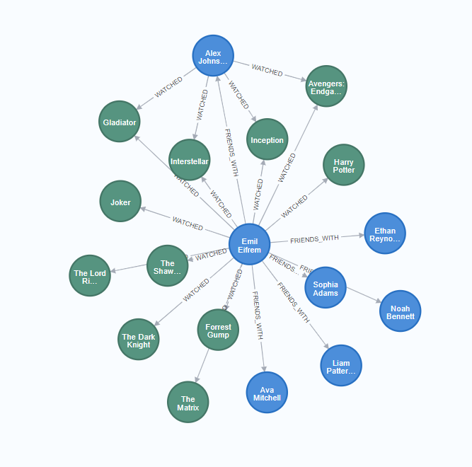
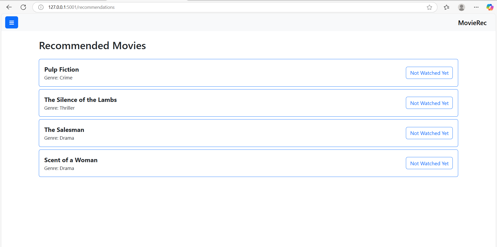

# 🎬 **Movie Recommendation System**  
_A Neo4j-powered movie recommendation system._  

  

## 📌 **Project Overview**  
This project is a **Movie Recommendation System** that helps users find movies based on:  
✔️ **Their friends' movie preferences**  
✔️ **Shared movie-watching history**  
✔️ **Genre-based similarity**  

🔹 The system uses a **Neo4j Graph Database** to model **Users**, **Movies**, and **Relationships** like:  
- `WATCHED` → (User → Movie)  
- `FRIENDS_WITH` → (User → User)  

It then applies **graph-based recommendation rules** to suggest movies.

---

## 📌 **How the Recommendation System Works?**  
The recommendation engine is built using **three key rules**:

### **1️⃣ Rule #1: Recommend Movies Watched by Friends (Same Genre)**
- Find **friends** of the user.
- Identify movies their **friends have watched**.
- Recommend **movies with the same genre** that the user enjoys.
- **Prioritize movies with the highest ratings.**  

---

### **2️⃣ Rule #2: Recommend Movies Watched by Similar Users**
- Identify **users** who have watched **at least 50% of the same movies** as the user.
- Recommend movies that **these users have watched** but the user hasn’t.
- **Ignore genres**, focus only on similarity.
- **Prioritize highest-rated movies.**  

---

### **3️⃣ Rule #3: Recommend the Top 3 Movies Based on Genre Popularity**
- Identify the **most popular movies in the same genres** the user enjoys.
- Rank movies **by the highest average rating from other users**.
- **Return only the top 3 movies** to avoid overwhelming the user.

---

## 🚀 **Installation Guide**  

### **1️⃣ Clone the Repository**
```sh
git clone https://github.com/amirmahdavieh/MovieRecommendationSystem.git
cd MovieRecommendationSystem
```

### **2️⃣ Install Dependencies**
```sh
pip install -r requirements.txt
```

---

## 🎥 **User Interface Preview**
### **1️⃣ Neo4j Graph Visualization**
The following graph structure is used in Neo4j to represent users, movies, and relationships.





### **2️⃣ Movie Recommendation Page**
The system suggests movies based on **friends' activity, shared history, and popular ratings.**  



